# مرجع تصميم صفحة لوحة التحكم (Dashboard)

**المشروع:** نظام إدارة الاستلام والتسليم المختبري
**المنصة الأساسية:** Vue 3 + Vite + Tailwind CSS
**اللغات:** العربية RTL افتراضيًا، والإنجليزية LTR مدعومة
**المرجع الأعلى:** [`design-system/lab-receipt-system/MASTER.md`](../../design-system/lab-receipt-system/MASTER.md)
**مرجع الصفحة:** [`design-system/lab-receipt-system/pages/dashboard.md`](../../design-system/lab-receipt-system/pages/dashboard.md)
**الإصدار:** 1.0
**الحالة:** مرجع تصميم وتنفيذ قبل إعادة بناء Dashboard

> لوحة التحكم في هذا النظام **لوحة تشغيل ومراقبة** وليست صفحة تسويقية. يجب أن تساعد المستخدم على معرفة حالة البيانات، اكتشاف العناصر التي تحتاج إجراءً، والانتقال بسرعة إلى العملية الصحيحة دون إخفاء التعارضات أو الإيحاء بأن snapshot محلي بيانات لحظية.

## 1. نطاق المرجع

يحدد هذا الملف البنية المرئية والتفاعلية لصفحة Dashboard، ومكونات الواجهة، وترتيب المعلومات، وحالات البيانات، والصلاحيات، ونطاق المؤسسة/الفرع، ومتطلبات Offline-first والوصول، واختبارات القبول. لا يلغي هذا المرجع أي قاعدة من `MASTER.md`؛ بل يخصصها لهذه الصفحة فقط [1].

الهدف هو تطوير Dashboard تدريجيًا فوق البيانات والخدمات الحالية، مع تجنب إضافة مؤشرات لا يملك Backend مصدرًا موثوقًا لها. إذا لم تتوفر بيانات كافية لرسم أو KPI، تعرض الصفحة حالة فارغة مفسرة بدل رقم مصطنع أو رسمًا مضللًا.

## 2. مبادئ التصميم الخاصة بالصفحة

تعتمد الصفحة أسلوب **Minimalism & Swiss Operations** بكثافة بيانات 8/10 وتباين مرتفع وحركة منخفضة. تكون الأرقام والحالات ومصدر البيانات أهم من الزخرفة، ويكون لكل منطقة عمل هدف رئيسي واضح. يجب ألا يحول hover أو animation دون القراءة، ويجب احترام `prefers-reduced-motion` ومتطلبات focus المرئي وحجم الهدف التفاعلي [2] [3] [4].

| مبدأ | التطبيق في Dashboard |
|---|---|
| سلامة البيانات | لا تعرض KPI بلا نطاق أو فترة أو وقت آخر تحديث. |
| الوضوح التشغيلي | اجعل Online/Offline/Pending/Conflict/Stale ظاهرًا في status strip ثابت. |
| سرعة القرار | ضع الأفعال السريعة والعناصر التي تحتاج تدخلًا قبل الرسوم غير الحرجة. |
| أقل مفاجأة | لا تجعل بطاقة متعددة الأفعال clickable بالكامل؛ اجعل الرابط أو الفعل مسمى. |
| الوصول | كل رسم له عنوان وملخص وبديل نصي/جدولي، وكل أيقونة زخرفية `aria-hidden`. |
| الخصوصية | لا تعرض PHI غير اللازمة، ولا تضع tokens أو تفاصيل حساسة في toast أو logs. |
| Offline-first | فرّق بصريًا بين `saved locally` و`synced remotely` و`snapshot stale`. |
| الأداء | لا تحجب UI thread بحسابات كبيرة أو export أو مزامنة طويلة. |

## 3. خريطة الهيكل العام

```mermaid
flowchart TD
    A[Dashboard Page Shell] --> B[Page Header]
    A --> C[Operational Status Strip]
    A --> D[KPI Grid]
    A --> E[Analytics Grid]
    A --> F[Attention Queue]
    A --> G[Recent Activity]
    A --> H[Quick Actions]

    B --> B1[Title + user context]
    B --> B2[Tenant/facility scope]
    B --> B3[Last updated + source]
    B --> B4[Primary action]

    C --> C1[Online/Offline]
    C --> C2[Pending sync]
    C --> C3[Conflict/Quarantine]
    C --> C4[Safe/Emergency]

    D --> D1[Total transactions]
    D --> D2[Approved]
    D --> D3[Draft]
    D --> D4[Organizations or attention count]

    E --> E1[Daily trend]
    E --> E2[Transaction types]
    E --> E3[Status distribution]

    F --> F1[Drafts]
    F --> F2[Rejected]
    F --> F3[Failed jobs]
    F --> F4[Conflicts]

    G --> G1[Recent transaction rows]
    G --> G2[Open details]
    H --> H1[New transaction]
    H --> H2[Search transactions]
    H --> H3[Reports]
```



## 4. ترتيب الصفحة من أعلى إلى أسفل

### 4.1 Page Header

يظهر العنوان في بداية المحتوى داخل `page-title` بحجم 24–28px، وتحتَه وصف مختصر داخل `page-subtitle`. يجب أن يتضمن header نطاق المؤسسة أو الفرع المستخدم في الطلب، أو عبارة واضحة مثل «النطاق الحالي: غير محدد» إذا لم يتوفر tenant context بعد. لا يستنتج المستخدم النطاق من الشعار أو sidebar فقط.

| العنصر | المحتوى المقترح | السلوك |
|---|---|---|
| العنوان | `مرحبًا، {username}` أو `لوحة التحكم` | يتغير بحسب اللغة دون كشف بيانات إضافية. |
| الوصف | وصف تشغيلي مختصر | لا يستخدم لغة تسويقية أو ادعاء real-time بلا دليل. |
| النطاق | المؤسسة، المنشأة، الفرع | مصدره session/Backend، وليس نصًا يحرره المستخدم. |
| التحديث | وقت آخر تحديث ومصدر البيانات | يميز Live عن Offline snapshot وStale. |
| الإجراء الأساسي | `معاملة جديدة` | زر primary واحد واضح، مع permission مناسبة. |
| إجراءات ثانوية | `المعاملات`، `التقارير`، `مزامنة` عند السماح | لا تُظهر أفعالًا غير مصرح بها. |

### 4.2 Operational Status Strip

هذه المنطقة ليست toast مؤقتًا. تبقى ظاهرة عند وجود حالة تؤثر في قرار المستخدم، وتستخدم لونًا مساعدًا مع نص صريح وأيقونة من مجموعة النظام. لا تعتمد على اللون وحده.

| الحالة | النص المقترح بالعربية | العرض | الإجراء |
|---|---|---|---|
| Online | `متصل — آخر مزامنة: …` | info/success | فتح تفاصيل المزامنة عند الحاجة. |
| Offline | `أنت تعمل محليًا — ستتم المزامنة لاحقًا` | info | فتح الطابور المحلي أو التعليمات. |
| Pending | `لديك {n} أحداث بانتظار المزامنة` | warning | فتح Pending queue. |
| Conflict | `لديك {n} تعارضات تحتاج مراجعة` | danger | فتح Quarantine، ولا تُغلق تلقائيًا. |
| Stale | `البيانات قديمة — آخر تحديث: …` | warning | إعادة المحاولة أو فتح مصدر البيانات. |
| Safe Mode | `الوضع الآمن مفعّل — العمليات محدودة` | info | عرض السبب والأفعال المسموحة. |
| Emergency | `وضع الطوارئ — استخدم الاستعادة أو الدعم` | danger | فتح recovery/support وفق الصلاحية. |

### 4.3 KPI Grid

تتكون الشبكة من أربع بطاقات في الشاشات الواسعة، وعمودين عند 768px، وعمود واحد عند 375px. كل بطاقة `gov-card` وظيفية وتحتوي label، قيمة رقمية، سياقًا زمنيًا أو نطاقًا، واتجاهًا إن كان الاتجاه محسوبًا من مصدر صحيح.

| KPI | مصدر البيانات الحالي | الرابط | ملاحظة UX |
|---|---|---|---|
| إجمالي المعاملات | `summary.total_transactions` | `/transactionslist` | يعرض النطاق والفترة. |
| المعاملات المعتمدة | `summary.by_status.approved` | `/transactionslist?status=approved` | اللون success مع نص `معتمدة`. |
| المسودات | `summary.by_status.draft` | `/transactionslist?status=draft` | اللون warning؛ تشير إلى الحاجة للمراجعة. |
| المؤسسات | `summary.total_organizations` | `/organizations` | لا تعرضها إن لم تكن ضمن صلاحية المستخدم. |

يجب استخدام `font-variant-numeric: tabular-nums` للأرقام، ومنع layout shift عند انتقال القيمة من skeleton إلى الرقم. لا تعني نسبة الاتجاه `trends.*` تحسنًا أو تراجعًا إلا إذا كانت الفترة المرجعية واضحة؛ عند غيابها يعرض الاتجاه كغير متاح بدل `0%` مضلل.

## 5. Analytics Grid

### 5.1 الاتجاه اليومي

يعرض الرسم عدد المعاملات خلال آخر سبعة أيام عند توفر البيانات. يحتوي على عنوان ووصف وعدد إجمالي، ويجب أن يكون الرسم قابلاً للفهم دون الاعتماد على اللون فقط. عند الحاجة، أضف جدول بيانات مخفيًا بصريًا أو بديلًا قابلًا للفتح يحتوي التاريخ والعدد.

| عنصر الرسم | القاعدة |
|---|---|
| المحور الزمني | تواريخ محلية منسقة حسب اللغة. |
| القيمة | أعداد صحيحة غير سالبة، مع `tabular-nums`. |
| العنوان | `الاتجاه اليومي للمعاملات`. |
| البديل | `aria-label` يصف نوع الرسم ونطاقه، وجدول بديل في النسخة الكاملة. |
| Empty state | `لا توجد بيانات كافية لعرض الاتجاه` مع عدم رسم محور مضلل. |
| Reduced motion | لا تعتمد على animation لظهور الأعمدة. |

### 5.2 توزيع أنواع المعاملات

يعرض `by_type` في صفوف progress دلالية، مع اسم النوع والعدد والنسبة. يجب أن تكون النسبة مقارنة بأكبر نوع أو بإجمالي موثق، ويجب توضيح أساس الحساب في tooltip أو helper text إذا كان هناك احتمال للالتباس. لا تُستخدم progress bar بلا label نصي.

### 5.3 توزيع الحالات

يعرض كل status مع label والعدد والنسبة، ويستخدم mapping موحدًا مع صفحة Reports وTransactions. يجب أن تظهر `Draft`, `Approved`, `Rejected`, `Archived`, و`Cancelled` بنفس المعاني والألوان في كل النظام، مع نص مساعد عند الحالات الحرجة.

## 6. Attention Queue

ينبغي أن تكون هذه المنطقة مخصصة للعناصر التي تحتاج قرارًا أو تدخلاً، لا مجرد قائمة إشعارات عامة. في النسخة الحالية، يمكن تمثيلها تدريجيًا عبر `smartInsights`، ثم فصلها لاحقًا إلى مكون `AttentionQueue` عندما تتوفر endpoints مستقلة للتعارضات والـjobs والنسخ الاحتياطية.

| العنصر | شرط الظهور | المستوى | الإجراء |
|---|---|---|---|
| مسودات | `draft > 0` | Medium/High حسب العدد | فتح المعاملات المصفاة. |
| مرفوضات | `rejected > 0` | High | فتح المرفوضات ومراجعة السبب. |
| تعارضات | `conflict_count > 0` | Critical | فتح quarantine؛ لا overwrite. |
| Jobs فاشلة | `failed_jobs > 0` | High | فتح تفاصيل job وإعادة المحاولة وفق السياسة. |
| Backup stale | آخر نسخة تتجاوز السياسة | Medium/High | فتح recovery/backup status. |
| مؤشرات مستقرة | لا توجد عناصر تحتاج إجراء | Low | عرض حالة معلوماتية، لا تحويلها إلى نجاح زائف. |

كل بطاقة attention تحتوي priority نصية، عنوانًا، شرحًا للأثر، ورابطًا أو button مسمى. لا تستخدم emoji كأيقونة؛ استبدل الرموز النصية الحالية مثل `!` و`↘` و`✓` بأيقونات SVG من `ICONS` عند تنفيذ إعادة التصميم البصري الكامل.

## 7. Recent Activity

يعرض القسم أحدث المعاملات في نطاق المستخدم، ويستخدم صفًا واضحًا يحتوي رقم المعاملة، النوع، المرسل، التاريخ، والحالة. تكون الصفوف قابلة للتنقل بالكيبورد إذا كانت interactive، مع `Enter` و`Space`، وfocus مرئي.

| الحقل | القاعدة |
|---|---|
| رقم المعاملة | يستخدم نمط code/numeric ولا يختصر بطريقة تمنع النسخ. |
| الحالة | badge نصي + لون مساعد؛ لا tooltip فقط. |
| التاريخ | تنسيق حسب locale مع timestamp واضح عند الحاجة. |
| الرابط | يفتح Transaction Details ضمن tenant scope. |
| البيانات الفارغة | `لا توجد معاملات بعد` مع رابط `معاملة جديدة` عند الصلاحية. |
| الخطأ | رسالة retry لا تمسح آخر snapshot الصحيح إن كان متاحًا. |

## 8. Quick Actions

تظهر الأفعال السريعة في بطاقة مستقلة، ويكون لكل action label مرئي وaccessible name. لا يجوز أن تظهر عملية حساسة مثل اعتماد أو حذف في Quick Actions من دون permission وconfirmation وربما re-auth حسب Risk Engine.

| الإجراء | النوع | الصلاحية المطلوبة | الوجهة |
|---|---|---|---|
| معاملة جديدة | Primary | create transaction | `/newtransaction` |
| بحث في المعاملات | Secondary | read transactions | `/transactionslist` |
| التقارير | Secondary | read/export reports بحسب الزر | `/reports` |
| المؤسسات | Secondary | read organizations | `/organizations` |
| مزامنة | Contextual | sync permission/device active | خدمة المزامنة، لا رابط وهمي |

## 9. نموذج البيانات المقترح للواجهة

تستخدم الصفحة payload واحدًا موحدًا قدر الإمكان، مع إبقاء التحويل داخل composable أو store وليس داخل كل بطاقة:

```js
{
  scope: {
    tenant_id: 'tenant-a',
    facility_id: 'facility-1',
    label: 'مختبر بغداد'
  },
  freshness: {
    mode: 'online', // online | offline | stale
    updated_at: '2026-08-26T10:00:00Z',
    source: 'remote' // remote | local_snapshot
  },
  sync: {
    pending: 0,
    conflicts: 0,
    last_success_at: '2026-08-26T09:58:00Z'
  },
  summary: {
    total_transactions: 0,
    total_organizations: 0,
    by_status: {},
    by_type: []
  },
  trend: [],
  recent_transactions: [],
  attention: []
}
```

إذا لم يدعم Backend حاليًا `scope`, `freshness`, أو `sync` في endpoint الخاص بالـDashboard، لا تُنشئ قيمًا صامتة من الواجهة. اعرض المعلومة كـ`غير متاح` أو اربطها بمصدر موثوق مستقل، ثم أضف contract API موثقًا في مرحلة لاحقة.

## 10. حالات الصفحة الكاملة

### 10.1 Loading

يظهر skeleton يحافظ على أبعاد KPI والرسوم والصفوف. يجب أن يحمل container `role="status"` و`aria-live="polite"` مع نص loading. لا تعرض أرقامًا صفرية أثناء التحميل لأن ذلك قد يُفهم كبيانات حقيقية.

### 10.2 Error

تظهر `status-strip--error` ثابتة نسبيًا، تحتوي وصفًا عامًا قابلًا للترجمة وزر `إعادة المحاولة`. لا تُظهر stack trace أو response خام أو token. إذا كان هناك snapshot سابق صالح، يمكن عرضه مع تحذير stale بدل إزالته بالكامل.

### 10.3 Empty

تختلف الرسالة حسب القسم: عدم وجود معاملات، عدم كفاية بيانات للرسم، أو عدم وجود عناصر تحتاج مراجعة. يجب أن يحتوي empty state على الإجراء التالي، مثل `إنشاء معاملة` أو `تعديل الفلاتر`، دون اختراع بيانات.

### 10.4 Offline

لا تحول Offline إلى error عام. يجب عرض آخر snapshot مع وقت التقاطه، وعدد الأحداث pending والتعارضات، وشرح ما يمكن فعله محليًا. أي زر مزامنة يعرض loading/failure/retry ولا يزيل payload عند الفشل.

### 10.5 Safe/Emergency

عند تفعيل الوضع الآمن أو الطوارئ، يظهر banner دائم يذكر السبب والعمليات المسموحة. يجب إخفاء أو تعطيل الأفعال غير المتاحة مع شرح السبب، وعدم إعطاء المستخدم انطباعًا بأن النظام يعمل طبيعيًا.

## 11. الصلاحيات ونطاق البيانات

يجب أن تكون أفعال Dashboard permission-aware، لكن لا تعتمد الحماية على إخفاء الأزرار. يقوم Backend بفرض RBAC وtenant/facility scope، بينما تستخدم الواجهة permissions لعرض الحالة الصحيحة فقط.

| الدور | Dashboard | KPI | Reports link | Organization link | Sensitive actions |
|---|---:|---:|---:|---:|---:|
| `admin` | نعم | نطاقه المصرح | حسب permission | نعم | confirmation + re-auth عند الحاجة |
| `supervisor` | نعم | نطاق منشآته | إن كان مصرحًا | حسب scope | confirmation |
| `user` | نعم | نطاقه التشغيلي | إن كان مصرحًا | غالبًا قراءة محدودة | منع افتراضي |
| `auditor` | حسب policy | قراءة فقط | قراءة/تصدير مضبوط | قراءة فقط | لا تعديل |
| anonymous | لا | لا | لا | لا | لا شيء |

يجب أن تفشل اختبارات IDOR إذا حاول مستخدم عرض KPI أو نشاط أو تقرير باستخدام tenant أو facility آخر. ولا يجوز أن يقبل العميل `tenant_id` لتوسيع النطاق؛ مصدر النطاق هو session/device context الموثوق في Backend.

## 12. Responsive Layout

| العرض | التخطيط |
|---:|---|
| 375px | عمود واحد، أفعال بعرض مناسب، بطاقات KPI كاملة، رسوم داخل scroll معلن أو بديل نصي. |
| 768px | عمودان لـKPI، رسمان متجاوران عند توفر العرض، queue قابلة للطي. |
| 1024px | KPI كاملة، analytics grid، attention queue، recent activity. |
| 1440px | max-width مريح، عدم تمديد النص أو البطاقات إلى عرض يصعّب القراءة. |

استخدم `margin-inline` و`padding-inline` و`gap` بدل left/right الثابتة. يجب اختبار RTL وLTR، والـzoom، وعدم ظهور horizontal overflow غير مقصود.

## 13. المكونات المقترحة

```text
frontend/src/components/dashboard/
├── DashboardHeader.vue
├── OperationalStatusStrip.vue
├── KpiGrid.vue
├── KpiCard.vue
├── AnalyticsGrid.vue
├── TrendChartPanel.vue
├── BreakdownPanel.vue
├── AttentionQueue.vue
├── RecentActivityTable.vue
└── QuickActions.vue
```

تستقبل المكونات props typed أو موثقة، ولا تنفذ API calls مباشرة. يدير `Dashboard.vue` أو composable واحد حالة التحميل والخطأ والمصدر والنطاق. يجب ألا تشارك المكونات SQLite connection أو أي state حساس مع worker؛ في الويب، تكون الطلبات عبر API client المركزي.

## 14. خطة التنفيذ المرحلية

| المرحلة | التغيير | معيار الخروج |
|---:|---|---|
| 1 | تطبيق header وstatus strip وKPI cards باستخدام tokens الحالية. | RTL/LTR، states، permissions، واختبارات component ناجحة. |
| 2 | استخراج charts إلى `ChartPanel` و`BreakdownPanel`. | بدائل ARIA/جدول، no layout shift، reduced motion. |
| 3 | فصل `AttentionQueue` عن smart insights. | بيانات موثوقة، actions مسماة، quarantine visible. |
| 4 | تحويل recent activity إلى جدول/مكوّن قابل للتصفح. | keyboard، focus، pagination/virtualization عند الحاجة. |
| 5 | ربط freshness/sync/scope بعقد API موثق. | Offline/Stale/tenant tests ناجحة. |
| 6 | فحص visual regression وperformance. | 375/768/1024/1440 وقياس عدم تجميد UI. |

لا تبدأ بإضافة رسوم جديدة قبل تحديد مصدرها وعقد API. ويمكن تنفيذ المرحلة الأولى دون تغيير Backend، باستخدام الحقول الحالية في `Dashboard.vue`، ثم إدخال scope وfreshness وattention عبر contract منفصل.

## 15. اختبارات القبول

### Unit وComponent

| الاختبار | النتيجة المتوقعة |
|---|---|
| payload طبيعي | تظهر KPI والرسوم والنشاط الأخير. |
| payload فارغ | تظهر empty states الخاصة بكل قسم. |
| loading | تظهر skeletons ولا تظهر أرقام صفرية مضللة. |
| API error | تظهر retry strip دون stack trace. |
| Offline snapshot | يظهر المصدر ووقت الالتقاط، ولا يظهر Live. |
| conflicts | يظهر warning/danger ثابت مع رابط quarantine. |
| reduced motion | لا تعتمد الصفحة على animation. |
| locale switch | تتغير labels والتواريخ وdir دون كسر layout. |

### Security وScope

يجب اختبار أن مستخدم Tenant B لا يرى marker أو KPI أو نشاط Tenant A، وأن تغيير `tenant_id` في query أو payload لا يغير النطاق. كما يجب اختبار عدم ظهور أفعال لا يملك المستخدم permission لتنفيذها، مع تذكر أن الاختبار الحقيقي للتفويض يكون في Backend أيضًا.

### Visual وAccessibility

ينبغي أخذ snapshots أو screenshots لحالات: loading، طبيعي، empty، error، offline، conflict، وSafe Mode، على 375 و768 و1024 و1440px وفي RTL وLTR. افحص contrast، focus، labels، names للأيقونات، ترتيب Tab، وعدم قص الرسائل. تستهدف العناصر التفاعلية حدًا أدنى 44×44px وفق قواعد المشروع وإرشادات حجم الهدف [4].

### Performance

يجب قياس زمن تحميل البيانات، وقت أول رسم، زمن تحديث KPI، وتكلفة render عند وجود 1000+ سجل في activity أو بيانات كبيرة. لا تُنفذ exports أو مزامنة أو معالجة كبيرة في UI thread، ولا تُعتبر الصفحة ناجحة لمجرد أن build ينجح.

## 16. Definition of Done

تعتبر Dashboard جاهزة للتنفيذ الإنتاجي عندما تستخدم tokens من `MASTER.md`، وتملك page override، وتعرض النطاق ومصدر البيانات وحالتها، وتغطي loading/empty/error/offline/stale/conflict، وتعمل RTL/LTR في المقاسات الأربعة، وتحتوي على focus وkeyboard وبدائل للرسوم، ولا تكشف PHI أو tokens، وتنجح اختبارات RBAC/IDOR وcomponent وvisual وperformance.

يجب أن يكون كل commit خاصًا بمرحلة قابلة للمراجعة. لا تجمع إعادة تصميم Dashboard مع tenant migrations أو تغييرات كبيرة في API أو منطق Chain of Custody في commit واحد.

## 17. مراجع

[1]: https://github.com/samertts/Receipt-and-delivery/blob/main/design-system/lab-receipt-system/MASTER.md "Receipt-and-delivery MASTER.md"
[2]: https://github.com/nextlevelbuilder/ui-ux-pro-max-skill/blob/main/.claude/skills/ui-ux-pro-max/SKILL.md "UI/UX Pro Max Skill"
[3]: https://www.w3.org/WAI/WCAG22/Understanding/focus-visible.html "WCAG 2.2 — Focus Visible"
[4]: https://www.w3.org/WAI/WCAG22/Understanding/target-size-minimum.html "WCAG 2.2 — Target Size Minimum"
